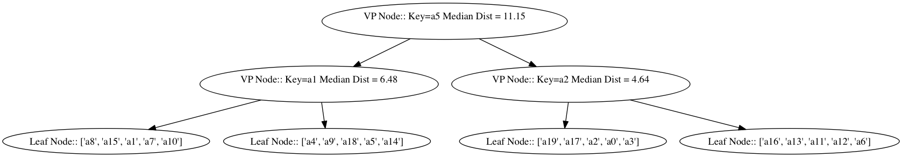

Timeseries Database
====================
Group project for CS207 Spring 2016. Team Name: **cs207project**

### [Documentation](http://cs207project.github.io/cs207project/)

### [Demo](https://github.com/CS207Project/cs207project/blob/master/tests/web_server_testing.ipynb)

### [Live Server](http://www.adjch.me:8080/tsdb)

### Implementation Details

#### 1. Architechure of Persistance
The Persistence of our database system is achieved as follows:
1. The meta data for each time series is stored in a heap file (metaheap). The meta data stores all submitted data, in addition to pointers to the associated time series data in a timeseries heap file.
2. The timeseries heap file (tsheap) stores the actual values of the time series.
3. A Primary Key Index stores the association between primary keys and their associated meta data offset (in metaheap). This index is implemented as a python dictionary in memory, stored using pickle and a write-ahead log.
4. Our database system supports two other types of indices.
    - The TreeIndex is a balanced binary search tree, which supports logarithmic lookup time. This index supports ordered selects, in addition to the standard selection criteria. It is implemented using the bintrees python module. The tree is not currently optimal, and supports O(n) insertion rather than O(log n).
    - The BitMask index is created for low-cardinality meta-data. It does not support ordering on selection.
5. In summary, our database supports O(1) insertion of new timeseries and lookup under primary key, O(log n) read/ select, including various criteria and operators, and O(n) insertion/ updating of metadata, where n is the number of timeseries in the database.

#### 2. Extension beyond milestone2 -- Vantage Point Trees

We implement Vantage Point Trees as descibed in [this paper](http://citeseerx.ist.psu.edu/viewdoc/summary?doi=10.1.1.43.7492).

##### Tree Construction
1. We start with a set of timeseries **S**, a set of vatnage points **V** and a distance function *d* which computes the distance between two points in our space. (Note that **V** is a subset of **S**). If **V** is empty, we make a new leaf node consisting of **S**. If not, we continue to the next steps.
2. We then pick a vantage point **v** at random from **V** and compute *d*(**v**,**s**) for all **s** in **S**.
3. Let M_v be the median of these distances. We then create a new node in the graph **n** which stores of the vantage point **v** and the median distance M_v.
4. We then split **S** into two **S_l** and **S_r** where **S_l** contains all the timeseries whose distance to **v** is less than M_v and **S_r** contains all the timeseries whose distance to **v** is greater than M_v.
5. We remove **v** from **V** and split the rest into **V_l** and **V_r** based on whether the given vantage points are in **S_l** or **S_r**
6. We then recursively start with **(S_l, V_l)** and **(S_r, V_r)** at step 1 as the left and right children of **n**

##### Finding the most similar timeseries
Rather than computing the distance to all the vantage points, we walk down this tree structure which cuts down the distance computations to log N (where N is the number of vantage points)

1. Given a query point **q** and the root node **n**, we compute *d*(**q**,**n**).
2. If *d*(**q**,**n**) < M (the median distance) then we go down the left branch of the tree, otherwise we down the right branch till we reach a leaf node.
3. We then compute the distance from **q** to every point in the leaf node and find the minimum.

This approach improves the performance of the similarily search by an order of magnitude.

#### 3. REST API and Demo
Please see the Demo and Documentation links above.

#### 4. Installation

Clone the repo and follow the instructions in the `.travis.yml` file.
